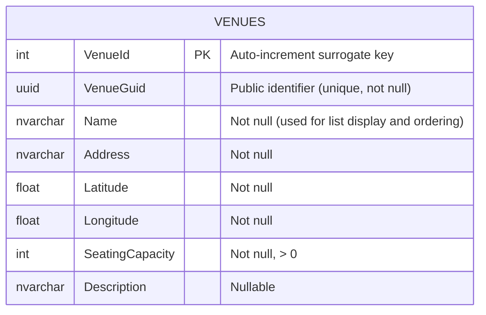

# SPEC001 — List Venues

- **User Story**: [US001 — List Venues](../user-stories/US001-List-Venues.md)
- **Status**: Draft

---

## 1. Overview

This specification defines the API contract and behaviour for listing all venues. Venues are physical locations where shows are held. The list endpoint is consumed by the Festify Venues page, which is reached from the landing page via a navigation card. The page displays venues by name in a scrollable container.

The list route is `GET /api/venues`. Venues are identified in the response by `venueGuid` (UUID). The API returns venues ordered by name so the UI can present a consistent, alphabetically sorted list.

---

## 2. Database Schema

### 2.1 ERD



### 2.2 Venues Table (relevant for list)

The list operation reads from the `Venues` table. Columns used for the list response and ordering:

| Column      | Type              | Use                                |
|-------------|-------------------|------------------------------------|
| `VenueGuid` | `uniqueidentifier`| Returned as `venueGuid` in response|
| `Name`      | `nvarchar(200)`   | Returned as `name`; sort key       |
| `Address`   | `nvarchar(500)`   | Returned in response               |
| `Latitude`  | `float`           | Returned in response               |
| `Longitude` | `float`           | Returned in response               |
| `SeatingCapacity` | `int`        | Returned in response               |
| `Description`     | `nvarchar(2000)` | Returned in response (nullable)    |

Ordering for the list is by `Name` ascending (case-insensitive collation recommended for consistent alphabetical order).

---

## 3. API Contract

### 3.1 OpenAPI Specification

```yaml
openapi: 3.0.3
info:
  title: Festify API
  version: 1.0.0

paths:

  /api/venues:

    get:
      summary: List all venues
      operationId: listVenues
      tags: [Venues]
      description: |
        Returns all venues ordered by name (ascending).
        Used by the Venues page to display venues in a scrollable list.
      responses:
        '200':
          description: A list of all venues, ordered by name
          content:
            application/json:
              schema:
                type: array
                items:
                  $ref: '#/components/schemas/VenueResponse'

components:

  schemas:

    VenueResponse:
      type: object
      properties:
        venueGuid:
          type: string
          format: uuid
          example: 3fa85f64-5717-4562-b3fc-2c963f66afa6
        name:
          type: string
          example: Metro Chicago
        address:
          type: string
          example: 3730 N Clark St, Chicago, IL 60613
        latitude:
          type: number
          format: double
          example: 41.9497
        longitude:
          type: number
          format: double
          example: -87.6631
        seatingCapacity:
          type: integer
          example: 1100
        description:
          type: string
          nullable: true
          example: Historic Chicago music venue since 1982.

    ProblemDetails:
      type: object
      properties:
        type:
          type: string
        title:
          type: string
        status:
          type: integer
        detail:
          type: string
```

---

## 4. Behaviour Notes

- **Ordering**: The list MUST be ordered by venue name ascending. Collation should be case-insensitive so that "Arena East" and "arena east" sort consistently (e.g. SQL Server `Name ASC` with a case-insensitive collation).
- **Empty list**: When no venues exist, the API returns `200 OK` with an empty array `[]`. The client (Venues page) shows an empty-state message; this is not an error.
- **Stability**: The same set of venues must produce the same order on repeated calls so the UI list is stable.
- **Identifier**: Only `venueGuid` is exposed; the internal `VenueId` is never returned. This supports stable, opaque public identifiers for use in links or future detail/update flows.
- **Errors**: On server or database errors, the API returns an appropriate 5xx response. On 401 Unauthorized, the client may redirect to sign-in or show an appropriate message per US001 acceptance criteria.
