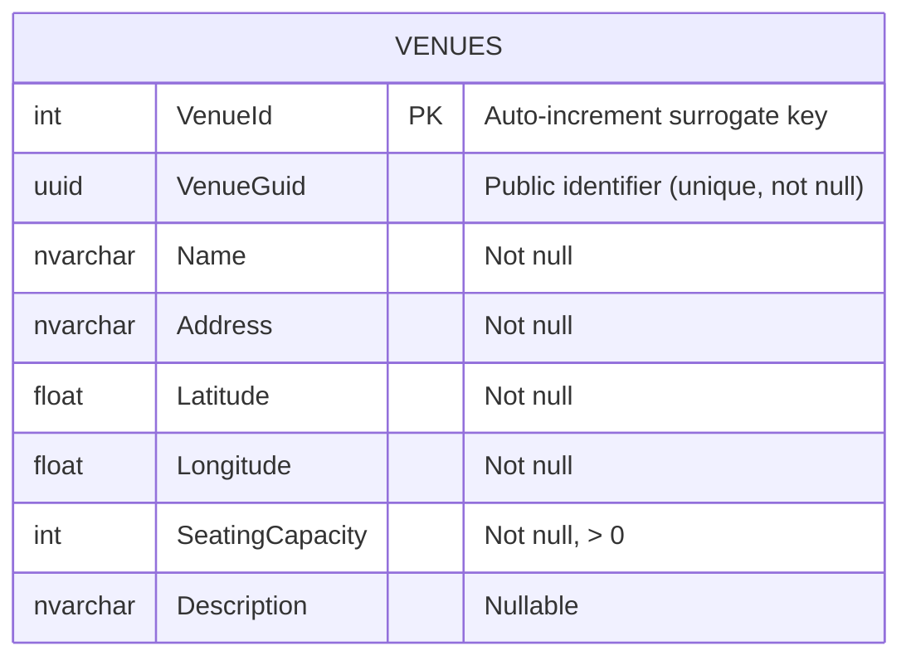

# SPEC001 — Venue Management

- **User Story**: [US002 — Venue Management](../user-stories/US002-Venue-Management.md)
- **Status**: Draft

---

## 1. Overview

This specification defines the API contract and database schema for Venue CRUD operations. Venues are physical locations where shows are held. They are identified externally by a `venueGuid` (UUID) and internally by a surrogate `venueId` (integer primary key).

All routes are prefixed with `/api/venues`. The `venueGuid` is used in URLs rather than the internal integer key to provide stable, opaque public identifiers.

---

## 2. Database Schema

### 2.1 ERD



### 2.2 Venues Table

| Column            | Type              | Constraints                     |
|-------------------|-------------------|---------------------------------|
| `VenueId`         | `int`             | PK, identity                    |
| `VenueGuid`       | `uniqueidentifier`| Not null, unique, default newid |
| `Name`            | `nvarchar(200)`   | Not null                        |
| `Address`         | `nvarchar(500)`   | Not null                        |
| `Latitude`        | `float`           | Not null                        |
| `Longitude`       | `float`           | Not null                        |
| `SeatingCapacity` | `int`             | Not null, check > 0             |
| `Description`     | `nvarchar(2000)`  | Nullable                        |

> **Note on Location**: Latitude and Longitude are stored as separate `float` columns for this iteration. They will be migrated to a `geography` point column (via NetTopologySuite) when geospatial search is implemented.

### 2.3 Migration Notes

- Add a unique index on `VenueGuid`.

---

## 3. API Contract

### 3.1 OpenAPI Specification

```yaml
openapi: 3.0.3
info:
  title: Festify API
  version: 1.0.0

paths:

  /api/venues:

    get:
      summary: List all venues
      operationId: listVenues
      tags: [Venues]
      responses:
        '200':
          description: A list of all venues
          content:
            application/json:
              schema:
                type: array
                items:
                  $ref: '#/components/schemas/VenueResponse'

    post:
      summary: Create a venue
      operationId: createVenue
      tags: [Venues]
      requestBody:
        required: true
        content:
          application/json:
            schema:
              $ref: '#/components/schemas/CreateVenueRequest'
      responses:
        '201':
          description: Venue created
          headers:
            Location:
              description: URL of the created venue
              schema:
                type: string
                example: /api/venues/3fa85f64-5717-4562-b3fc-2c963f66afa6
          content:
            application/json:
              schema:
                $ref: '#/components/schemas/VenueResponse'
        '400':
          $ref: '#/components/responses/BadRequest'

  /api/venues/{venueGuid}:

    parameters:
      - name: venueGuid
        in: path
        required: true
        schema:
          type: string
          format: uuid
        example: 3fa85f64-5717-4562-b3fc-2c963f66afa6

    get:
      summary: Get a venue by GUID
      operationId: getVenue
      tags: [Venues]
      responses:
        '200':
          description: The requested venue
          content:
            application/json:
              schema:
                $ref: '#/components/schemas/VenueResponse'
        '404':
          $ref: '#/components/responses/NotFound'

    put:
      summary: Update a venue
      operationId: updateVenue
      tags: [Venues]
      requestBody:
        required: true
        content:
          application/json:
            schema:
              $ref: '#/components/schemas/UpdateVenueRequest'
      responses:
        '200':
          description: Venue updated
          content:
            application/json:
              schema:
                $ref: '#/components/schemas/VenueResponse'
        '400':
          $ref: '#/components/responses/BadRequest'
        '404':
          $ref: '#/components/responses/NotFound'

    delete:
      summary: Delete a venue
      operationId: deleteVenue
      tags: [Venues]
      responses:
        '204':
          description: Venue deleted
        '404':
          $ref: '#/components/responses/NotFound'

components:

  schemas:

    CreateVenueRequest:
      type: object
      required: [name, address, latitude, longitude, seatingCapacity]
      properties:
        name:
          type: string
          maxLength: 200
          example: Metro Chicago
        address:
          type: string
          maxLength: 500
          example: 3730 N Clark St, Chicago, IL 60613
        latitude:
          type: number
          format: double
          minimum: -90
          maximum: 90
          example: 41.9497
        longitude:
          type: number
          format: double
          minimum: -180
          maximum: 180
          example: -87.6631
        seatingCapacity:
          type: integer
          minimum: 1
          example: 1100
        description:
          type: string
          maxLength: 2000
          nullable: true
          example: Historic Chicago music venue since 1982.

    UpdateVenueRequest:
      type: object
      required: [name, address, latitude, longitude, seatingCapacity]
      properties:
        name:
          type: string
          maxLength: 200
          example: Metro Chicago
        address:
          type: string
          maxLength: 500
          example: 3730 N Clark St, Chicago, IL 60613
        latitude:
          type: number
          format: double
          minimum: -90
          maximum: 90
          example: 41.9497
        longitude:
          type: number
          format: double
          minimum: -180
          maximum: 180
          example: -87.6631
        seatingCapacity:
          type: integer
          minimum: 1
          example: 1100
        description:
          type: string
          maxLength: 2000
          nullable: true

    VenueResponse:
      type: object
      properties:
        venueGuid:
          type: string
          format: uuid
          example: 3fa85f64-5717-4562-b3fc-2c963f66afa6
        name:
          type: string
          example: Metro Chicago
        address:
          type: string
          example: 3730 N Clark St, Chicago, IL 60613
        latitude:
          type: number
          format: double
          example: 41.9497
        longitude:
          type: number
          format: double
          example: -87.6631
        seatingCapacity:
          type: integer
          example: 1100
        description:
          type: string
          nullable: true
          example: Historic Chicago music venue since 1982.

    ProblemDetails:
      type: object
      properties:
        type:
          type: string
        title:
          type: string
        status:
          type: integer
        detail:
          type: string

  responses:

    BadRequest:
      description: Validation error
      content:
        application/json:
          schema:
            $ref: '#/components/schemas/ProblemDetails'

    NotFound:
      description: Resource not found
      content:
        application/json:
          schema:
            $ref: '#/components/schemas/ProblemDetails'
```

---

## 4. Behaviour Notes

- `venueGuid` is assigned by the server on creation; clients must not supply it.
- `venueId` is never exposed in the API.
- `SeatingCapacity` must be a positive integer; the API returns 400 if it is zero or negative.
- `Latitude` / `Longitude` are validated to their legal ranges (±90 / ±180) but are otherwise stored as-is. Coordinate system is WGS 84.
