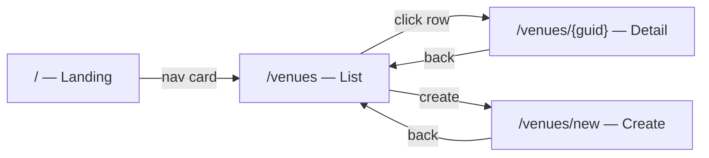

# WF001 — List Venues

- **User Story**: [US001 — List Venues](../user-stories/US001-List-Venues.md)
- **Status**: Draft

---

## 1. Overview

This wireframe defines the **Venues list page** (`/venues`): layout, routes, Atomic Design components, interactions, and API mappings. It implements the UI described in US001 and is consumed by the Festify Blazor frontend per the `blazor-ui` skill.

The page sits at **steps 1–3 and 7** of [JNY-001 — Manage Venue Catalog](../journeys/JNY-001-Manage-Venue-Catalog.md). Jordan the Venue Manager arrives from the landing page and scans an alphabetically sorted list of venue names.

---

## 2. Position in End-to-End Flow



This wireframe covers **List** only. Create and detail flows are defined in [WF002 — Venue Management](WF002-Venue-Management.md).

| Journey step | Page | Wireframe |
|--------------|------|-----------|
| 1 | Landing | — |
| 2–3, 7 | Venues list | **WF001** (this document) |
| 4–6 | Venue detail / create | [WF002](WF002-Venue-Management.md) |

---

## 3. Routes

| Route | Page component | Purpose |
|-------|----------------|---------|
| `/venues` | `Pages/Venues.razor` | List all venues |

---

## 4. Page — Venues List

### 4.1 Layout

Centered content column (`max-width: 40rem`). Semantic `<main class="venues-page">`.

```
┌─────────────────────────────────────────┐
│  Venues                                 │
├─────────────────────────────────────────┤
│  ┌───────────────────────────────────┐  │
│  │ Arena East                        │  │
│  │ Metro Chicago                     │  │
│  │ The Grand Hall                    │  │
│  │ ...                               │  │  scrollable (max-height 70vh)
│  └───────────────────────────────────┘  │
└─────────────────────────────────────────┘
```

### 4.2 Component Inventory

| Component | Level | File (proposed) | Description |
|-----------|-------|-----------------|-------------|
| Page heading | Atom | — | `<h1>Venues</h1>` |
| Loading indicator | Atom | — | Muted text: "Loading venues…" |
| Error message | Molecule | — | Alert box with message and action link |
| Venue list | Organism | `UI/Organisms/VenueList.razor` | Scrollable bordered container |
| Venue list item | Molecule | `UI/Molecules/VenueListItem.razor` | Single venue name row |
| Empty state message | Atom | — | Italic text: "No venues exist." |

### 4.3 States

| State | What the user sees | Visible components |
|-------|--------------------|--------------------|
| Loading | "Loading venues…" | Loading indicator |
| Loaded | Alphabetically sorted venue names in scrollable list | Venue list, venue list items |
| Empty | "No venues exist." inside list container | Empty state message |
| Unauthorized | Error message + "Sign in" link | Error message |
| Network error | Connection message + "Retry" link | Error message |
| Server error | "Venues could not be loaded." + "Retry" link | Error message |

### 4.4 Interactions

| Trigger | Behavior |
|---------|----------|
| Page load | `VenueService.GetVenuesAsync()` → `GET /api/venues` |
| Retry link | Full page reload of `/venues` |
| Sign in link | Navigate to `/sign-in` |
| Scroll | List scrolls vertically when content exceeds 70vh |

List items are **display-only** in WF001. Navigation to detail and the Create venue action are added by [WF002](WF002-Venue-Management.md).

### 4.5 API Mapping

| UI action | API | Spec |
|-----------|-----|------|
| Load list | `GET /api/venues` | [SPEC001](../specs/SPEC001-List-Venues.md) |

| Response field | UI use |
|----------------|--------|
| `name` | Displayed in each list row; sort key (server-ordered) |
| `venueGuid` | Not displayed; used by WF002 for detail links |

---

## 5. Visual Conventions

Shared with other venue pages (see [WF002](WF002-Venue-Management.md) §6).

| CSS class | Purpose |
|-----------|---------|
| `.venues-page` | Page container |
| `.venues-loading` | Muted loading text |
| `.venues-error` | Red-tinted alert (`role="alert"`) |
| `.venues-empty` | Muted italic empty state |
| `.venues-list` | Scrollable bordered list |
| `.venue-item` | Padded list row |
| `.venue-name` | Venue name text (word-wrap) |
| `.btn-link` | Inline action link in error states |

---

## 6. Traceability

| Artifact | Link |
|----------|------|
| **User Story** | [US001 — List Venues](../user-stories/US001-List-Venues.md) |
| **Spec** | [SPEC001 — List Venues](../specs/SPEC001-List-Venues.md) |
| **Journey** | [JNY-001 — Manage Venue Catalog](../journeys/JNY-001-Manage-Venue-Catalog.md) (steps 1–3, 7) |
| **Persona** | [Jordan the Venue Manager](../personas/venue-manager.md) |
| **Related wireframe** | [WF002 — Venue Management](WF002-Venue-Management.md) |
| **Implementation** | `Festify.Web/Components/Pages/Venues.razor` |
