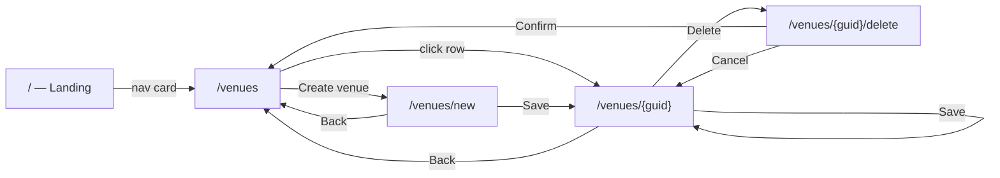

# WF002 — Venue Management

- **User Story**: [US002 — Venue Management](../user-stories/US002-Venue-Management.md)
- **Status**: Draft

---

## 1. Overview

This wireframe defines the **venue CRUD UI**: create, view/edit, and delete confirmation pages. It extends the list page defined in [WF001 — List Venues](WF001-List-Venues.md) and maps to the API contract in [SPEC002 — Venue Management](../specs/SPEC002-Venue-Management.md).

The UI uses **static server-side rendering** (no interactive Blazor render mode). Form submissions and navigation are full page requests with antiforgery tokens.

Jordan the Venue Manager uses these pages at **steps 4–6** of [JNY-001 — Manage Venue Catalog](../journeys/JNY-001-Manage-Venue-Catalog.md), with alternate paths for creating a new venue and handling validation or API errors.

---

## 2. Position in End-to-End Flow



| Journey step | Route | Wireframe section |
|--------------|-------|-------------------|
| 1 | `/` | — |
| 2–3, 7 | `/venues` | [WF001](WF001-List-Venues.md) + §3 extensions below |
| 4–6 | `/venues/{guid}` | §4 Venue detail |
| Alt — create | `/venues/new` | §5 Venue create |
| Alt — delete | `/venues/{guid}/delete` | §6 Delete confirmation |

---

## 3. List Page Extensions (WF001 + US002)

WF001 defines the base list. US002 adds entry points on `/venues`:

### 3.1 Layout change

```
┌──────────────────────────────────────────┐
│  Venues                    [Create venue]│
├──────────────────────────────────────────┤
│  ┌────────────────────────────────────┐  │
│  │ Arena East                    →    │  │  ← each row is a link
│  │ Metro Chicago                 →    │  │
│  └────────────────────────────────────┘  │
└──────────────────────────────────────────┘
```

### 3.2 Additional components

| Component | Level | File (proposed) | Description |
|-----------|-------|-----------------|-------------|
| Create venue button | Atom | `UI/Atoms/CreateVenueButton.razor` | Link to `/venues/new` |
| Page header row | Molecule | — | Heading + Create venue button |

### 3.3 Additional interactions

| Trigger | Behavior |
|---------|----------|
| Click venue row | Navigate to `/venues/{venueGuid}` |
| Click Create venue | Navigate to `/venues/new` |
| Empty state | Show "No venues exist." plus Create venue link |

---

## 4. Routes

| Route | Page component | Purpose |
|-------|----------------|---------|
| `/venues/new` | `Pages/VenueCreate.razor` | Create a venue |
| `/venues/{VenueGuid:guid}` | `Pages/VenueDetail.razor` | View and edit a venue |
| `/venues/{VenueGuid:guid}/delete` | `Pages/VenueDelete.razor` | Confirm deletion |

---

## 5. Page — Venue Detail (edit)

### 5.1 Layout

```
┌─────────────────────────────────────────┐
│  ← Back to venues                       │
│  Metro Chicago                          │
├─────────────────────────────────────────┤
│  [success banner if ?saved=true]        │
│  [API error banner if save failed]      │
│                                         │
│  Name          [________________]       │
│  Address       [________________]       │
│  Seating       [____]                   │
│  capacity                               │
│  Latitude      [____]  Longitude [____] │
│  Description   [                    ]   │
│                                         │
│  [Save]                    [Delete]     │
└─────────────────────────────────────────┘
```

### 5.2 States

| State | What the user sees | Visible components |
|-------|--------------------|--------------------|
| Loading | "Loading venue…" | Loading indicator |
| Loaded | Form with current values | Back link, heading, venue form, Save, Delete |
| Validation error | Form with inline field errors | Venue form, validation messages, Save, Delete |
| Save success | Success banner + updated form | Success banner, venue form |
| Save error | API error banner + preserved values | Error banner, venue form |
| Not found | Error message + back link | Error message, back link |

### 5.3 Interactions

| Trigger | Behavior |
|---------|----------|
| Page load | `GET /api/venues/{venueGuid}`; pre-populate form |
| Save | POST → `PUT /api/venues/{venueGuid}`; redirect to `?saved=true` on success |
| Delete | POST → navigate to `/venues/{venueGuid}/delete` |
| Back | Navigate to `/venues` |
| 404 on load | Show not-found error with back link |

---

## 6. Page — Venue Create

Same form layout as §5.1 without Delete button. Heading displays **"New Venue"**.

### 6.1 States

| State | What the user sees | Visible components |
|-------|--------------------|--------------------|
| Creating | Empty form | Back link, heading, venue form, Save |
| Validation error | Form with inline field errors | Venue form, validation messages, Save |
| Save error | API error banner + preserved values | Error banner, venue form |

### 6.2 Interactions

| Trigger | Behavior |
|---------|----------|
| Page load | Render empty form |
| Save | POST → `POST /api/venues`; redirect to `/venues/{newGuid}?saved=true` on 201 |
| Back | Navigate to `/venues` |

---

## 7. Page — Delete Confirmation

Separate confirmation page (no client-side modal).

### 7.1 Layout

```
┌─────────────────────────────────────────┐
│  Delete venue?                          │
│                                         │
│  Are you sure you want to delete        │
│  "Metro Chicago"? This cannot be undone.│
│                                         │
│  [Confirm delete]    Cancel             │
└─────────────────────────────────────────┘
```

### 7.2 States

| State | What the user sees | Visible components |
|-------|--------------------|--------------------|
| Confirmation | Venue name and action buttons | Heading, message, Confirm, Cancel |
| Not found | Error message + back link | Error message, back link |
| Delete error | Error banner | Error banner, Confirm, Cancel |

### 7.3 Interactions

| Trigger | Behavior |
|---------|----------|
| Page load | `GET /api/venues/{venueGuid}` for display name |
| Confirm delete | POST → `DELETE /api/venues/{venueGuid}`; redirect to `/venues` |
| Cancel | Navigate to `/venues/{venueGuid}` |

---

## 8. Shared Form — Component Inventory

Create and detail pages share one **VenueForm** organism.

| Component | Level | File (proposed) | Description |
|-----------|-------|-----------------|-------------|
| Back link | Atom | `UI/Atoms/BackLink.razor` | "Back to venues" → `/venues` |
| Page heading | Atom | — | Venue name or "New Venue" |
| Text input | Atom | `UI/Atoms/TextInput.razor` | Name, Address |
| Number input | Atom | `UI/Atoms/NumberInput.razor` | Seating capacity, Latitude, Longitude |
| Text area | Atom | `UI/Atoms/TextArea.razor` | Description |
| Validation message | Atom | — | Inline message beneath invalid field |
| Save button | Atom | `UI/Atoms/PrimaryButton.razor` | Form submit |
| Delete button | Atom | `UI/Atoms/DangerButton.razor` | POST to delete route (detail only) |
| Success banner | Atom | — | "Venue saved." (`?saved=true`) |
| API error banner | Molecule | — | `.venues-error` with ProblemDetails message |
| Venue form | Organism | `UI/Organisms/VenueForm.razor` | All fields and action buttons |
| Delete confirmation | Template | `UI/Templates/DeleteConfirmationTemplate.razor` | Heading, body, and action slots |

### 8.1 Form fields

| Label | Control | Required | Constraints |
|-------|---------|----------|-------------|
| Name | Text input | Yes | max 200 |
| Address | Text input | Yes | max 500 |
| Seating capacity | Number input | Yes | integer ≥ 1 |
| Latitude | Number input | Yes | −90 … 90 |
| Longitude | Number input | Yes | −180 … 180 |
| Description | Text area | No | max 2000 |

Validation runs on form submission (server-side). Failed validation re-renders the page with inline messages and submitted values preserved.

---

## 9. API Mapping

| UI action | HTTP | Spec operation |
|-----------|------|----------------|
| Load detail | `GET /api/venues/{venueGuid}` | `getVenue` |
| Create | `POST /api/venues` | `createVenue` |
| Update | `PUT /api/venues/{venueGuid}` | `updateVenue` |
| Delete | `DELETE /api/venues/{venueGuid}` | `deleteVenue` |

| Request / response field | Form field |
|--------------------------|------------|
| `name` | Name |
| `address` | Address |
| `seatingCapacity` | Seating capacity |
| `latitude` | Latitude |
| `longitude` | Longitude |
| `description` | Description |
| `venueGuid` | Assigned by server on create; used in route only |

---

## 10. Visual Conventions

All pages use `<main class="venues-page">` and `<PageTitle>` consistent with [WF001](WF001-List-Venues.md).

| CSS class | Purpose |
|-----------|---------|
| `.venues-page` | Centered page container |
| `.venues-error` | Red-tinted alert (`role="alert"`) |
| `.venues-success` | Green-tinted success banner |
| `.venues-loading` | Muted loading text |
| `.venue-form` | Form field stack and spacing |
| `.venue-form-actions` | Save and Delete button row |
| `.venues-page-header` | List page title + Create button row |
| `.btn-link` | Secondary inline actions |
| `.btn-primary` / `.btn-danger` | Save and Delete/Confirm buttons |

---

## 11. Traceability

| Artifact | Link |
|----------|------|
| **User Story** | [US002 — Venue Management](../user-stories/US002-Venue-Management.md) |
| **Spec** | [SPEC002 — Venue Management](../specs/SPEC002-Venue-Management.md) |
| **Journey** | [JNY-001 — Manage Venue Catalog](../journeys/JNY-001-Manage-Venue-Catalog.md) (steps 4–6) |
| **Persona** | [Jordan the Venue Manager](../personas/venue-manager.md) |
| **Related wireframe** | [WF001 — List Venues](WF001-List-Venues.md) |
| **Implementation** | `Festify.Web/Components/Pages/` (to be added) |
